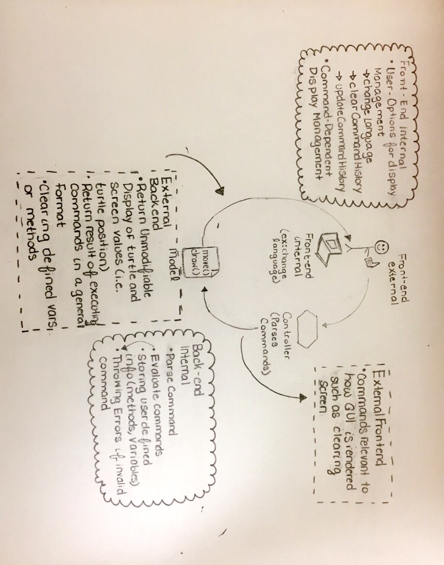
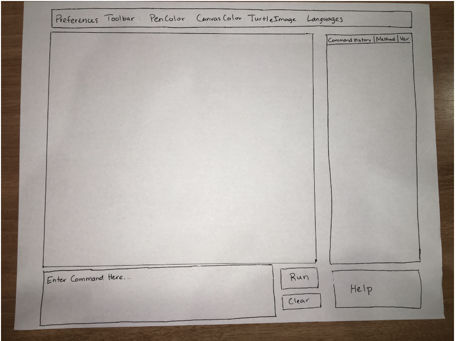

# Design Plan
###Authors: Ryan Culhane, Anna Darwish, Lewis Jensen, Megan Phibbons  
##Introduction
* We are trying to create an application where novice programmers can gain experience with programming in an intuitive manner.  The application should also give more experienced programmers the flexibility to create more sophisticated programs.  The program should be interactive and responsive enough to allow users to see the output of their commands immediately (REPL) and allow them to reuse and build off previous commands.
* We want our code to be more flexible in adding new commands to the list of possible commands. In terms of UI, it should be easy to do things like change languages, add a new language, or change existing language. 
* Closed: The way that the UI interacts with the commands. For example, adding in new commands should not change the way that the UI passes commands to the parser. Method functionality should all be in back-end, but UI code should not need to be changed. 
* Open: New commands should be open to extension, the languages that our project uses, instructional information should be open, syntax handling (i.e. real-time code checking). User preferences should be easy to change

## Design Overview
**The picture below describes our general structure of our project.**  
  
**APIs:**
* Front-end external:
    * Give the typed in commands
* Front-end internal:
    * Color changes/Preferences
    * Updating panels of available variables and methods, command history
* Back-end external:
    * Give the new positioning of the turtle/where lines were drawn
    * Report errors in parsing
* Back-end internal:
    * Processing the commands
    * Executing the commands
    
**General Steps:**
* Use case for our design: The user types in a command to GUI.  The GUI sends the command to the parser.  The parser parses the command and tells the Model what to commands to execute.  The Model executes the command, updating the state of the back end.  The back end notifies the GUI that the command has been processed and is ready to be displayed.  The GUI asks the back end for the necessary information to update the display and updates the display.

**Classes:**
* Front-End:
    * Classes for item that will appear on screen
        * Buttons
        * Turtle and canvas
        * Command line
        * Tabs for history, methods, and variables
    * Class to build GUI
* Back-End:
    * Command superclass
        * One class for every command
    * Parser uses different Commands
        * Passes command handler a tree of nodes with commands/values
    * Turtle - keeps track of turtle’s location and possibly drawings
        * Locations kept as doubles
        
##User Interface:
* The picture below describes our user interface

* The preferences toolbar will contain dropdown buttons so the user can make changes to the interface
* The history, methods, and variables will be different tabs on one area of the screen.

##API Details
* This can be viewed in the src folder, where we designed 4 interfaces corresponding to the APIs for front-end/back-end internal/external. The comments go in-depth about when each of these are used, how they are used, and what requirements they fill. 
* Front-end internal
    * changeBackgroundColor()
        * Uses Paint from javafx
        * Its intended use is to be called from the front-end when the user tries to change a color. 
        * This could be extended by adding in additional background colors or other types of backgrounds. 
    * changeLanguage()
        * Uses properties files to load in different language choices
        * Its intended use it to select from multiple different languages to fulfill the requirement in the Basic implementation
        * This could be extended by adding in more properties files and adding to the dropdown list
    * displayError()
        * Triggered by exceptions being thrown to external methods. 
        * Its intended purpose is to make sure that the project never crashes, and instead handles exceptions as they happen and alerts the User that they have done something incorrectly
        * This could be extended by throwing different kinds of errors
    * displayHelpPage()
        * This is a method called when the user clicks on the help page tab. 
        * This depends on properties files read in that store the help file text
        * This is also influenced  by the current language
        * Its purpose is to fulfill the help page requirement in the Basic implementation.
        * This could be extended by adding in different languages or more help instructions
    *render()
        * Creates the initial states within the file
        * Called at startup
        * This could be extended by adding in new buttons/properties to the UI, because everything is initialized here
    * updateCommandHistory()
        * Adds in commands to the history of commands displayed to the user. 
        * The purpose of this fulfills the requirement of storing command history
        * This could be extended by only saving unique commands, allowing the user to select commands from history and put them in the text box, etc.
    * updateDisplay()
        * Updates the display with the newest turtle position and drawing
        * When the user chooses to clear the command history, their button press triggers this method to be called. 
        * This is to add in functionality to history
        * This could be extended to only delete certain elements within the history
    * updateVariableView()
        * When the user adds in a new variable, this is called to be added to the list
    * clearCommandHistory() 
        * Clears the user’s command history
* Front-end external
    * clearScreen()
        * The purpose of this is when the user inputs a command to clear the screen. This is to fulfill the requirement of being able to reset things.
        * This could be extended by possibly having an undo function that changes your screen back to what it was. 
* Back-end internal
    * evaluateCommand()
        * The purpose of this is so that the back-end can send itself commands and process them
        * This satisfies the requirement of having commands
        * This can be extended by creating new types of commands or any number of commands
        * This is called by evaluateCommandTree()
        * Throw UnknownCommandException if the user inputs a command that does not exits
        * Throw InvalidArgumentException if the user inputs too many, too few, or improper arguments associated with the command
        * Throw IllegalMathException if the user inputs a command that can not be evaluated, such as dividing by zero
    * evaluateCommandTree()
        * This traverses through the command tree and calls evaluateCommand() on every command in the tree. 
        * This also satisfies having commands and can be extended by adding in new types or a number of parameters
    * getCommandTree()
        * This is a method that the parser has that allows for the controller to see all of the commands registered by the parser. 
        * This satisfies having commands
        * saveUserDefinedCommand()
        * When a user defines a command, stores it so that it can be called again. 
    * saveUserVariable()
        * When a user defines a variable, stores it so that it can be used later in the code
* Back-end external
    * getUnmodifiableDisplay()
        * The purpose of this is to allow the back-end to communicate with the front-end and pass on information about command results
        * This allows the back-end to communicate with the front-end
        * In order to extend this, the unmodifiable turtle can be given more parameters and checking 
        * This is called when the commands are done being processed
    * getCommandResult()
        * Returns the result of the executed command
        * This is called by the front end after the commands finish executing
        * This could be extended by allowing command results to be a variety of different types (Strings, ints, doubles, etc)

##API Example Code
* Example Code:
    * myParser.parse(String command);
        * validateCommand(String command)
            * Error checking
    * Command c = parse(String command) 
        * evaluateCommand(String command)
    * c.execute(myParameters)
    * SlogoModel.update()
        * myTurtle.updatePosition()
        * myTurtlePen.draw()
    * myDisplay.update();
        * myDisplay.updateTurtle()
        * myDisplay.updateCommandHistory()
* Megan Use Case 1: Reading a command with n parameters
    * Take in command from UI
    * Parse the first word from the command and create a node to determine the number of parameters it takes
        * WITHIN COMMAND: 
            * If the command does not exist, throw an InvalidCommandException
            * If there is an invalid number of parameters, throw an InvalidParametersException
    * Then, parse the number of parameters necessary and create a new command with the given parameters
    * Call command.execute
* Megan Use Case 2: Reading a command with a command as a parameter
    * Take in the command from UI
    * Parse the first word of the command and determine the number of parameters it takes
    * If it encounters another command, then evaluate that command before proceeding
* Anna Use Case 1: Given a nested Math operations command such as QUOTIENT expr1 expr2
    * Evaluate expr1 by invoking the needed math commands for it
        * Parser would provide this information
    * Store value of expr1
    * Evaluate expr2 by invoking the needed math commands for it
        * Parser would provide this information
    * Take the quotient of expr1 and expr2
        * Throw InvaidMathOperation if expr2 evaluates to be 0 or if either expression is evaluated to be undefined
    * Controller invokes GUI to update display, which calls on backend operations to provide result of operation
* Anna Use Case 2: User runs a for-loop control structure and moves the turtle x pixels forward each iteration and draws the turtle’s path
    * Takes in move command (this should probably be a list of commands in case the for loop ever has to execute multiple commands) and number of iterations
    * Invokes the Turtle’s moveForward(double x) method
        * Store Turtle’s initialLocation on first iteration 
        * Updates Turtle’s currLocation
    * Tell TurtlePen to draw a line from Turtle’s initalLocation to Turtle’s new currentLocation
* Louis Use Case 1: User changes color of the turtle background
    * Store the color the user chooses in an instance variable myBackgroundColor in the GUI class
    * Set the background color of the turtle’s canvas to the instance variable myBackgroundColor
* Louis Use Case 2: User types in a command and presses run
    * Store the text that the user enters as a String
    * Send the String to the parser
    * Update the GUI to display the new positioning and potential lines drawn by the turtle
* Ryan Use Case 1: User changes clicks on clear to clear the screen
    * Remove the text from the command prompt reverting back to the default text
    * Send clear message to the back end to reset the turtle’s position to 0,0 and orientation to due north
    * Remove all lines drawn on the canvas, keep the canvas the same background color
* Ryan Use Case 2: User clicks on tab to view their command history
    * Switch the command history tab to be raised
    * Switch the currently raised tab to no longer be raised
    * Display the command history with most recent commands appearing at the top of the pane

## Design Considerations
* Command hierarchy: 
    * Subclasses based on command type:
        * Pros: easier to understand
        * Cons: Not much difference between the different subclass types
    * Subclasses based on number of inputs
        * Pros: Makes parsing a bit easier
        * Cons: not different functionality between different # of inputs
    * Subclasses based on individual commands
        * Pros: Different implementation, easy to add new command types
        * Cons: there will be a lot of different subclasses, can be confusing
* Lasting concerns:
    * Nested commands
    * Commands with different numbers of parameters
    * NOTE: Need to develop some sort of order of operations for commands
    * Communication Between Model and View in Exception Cases
        * If the user inputs an expression that is not known to be invalid until it is evaluated (such as dividing by zero) how will this be communicated from Model to View if it must be mediated through Controller?
    * In the case of a for loop executing commands that a user can see (i.e. turtle moving forward 10 pixels), should they only see the final result, or should they see iterations of each update?

## Example Code
* Individual Responsibilities
    * Louis: Front-end: External API
        * Handle communication from front-end to parser
        * Catch and display the exceptions/error messages received from back-end when trying to run a user command
        * Handle the display updates received from the back-end
    * Ryan: Front-end: Internal API
        * Create the GUI components
        * Write methods to allow the GUI components to communicate to one another
        * Allow for changes to display and settings
    * Megan: Back-end
        * Work on the Parser object, which creates a tree of ParsedNodes that essentially creates a hierarchy to be traversed. When traversed, Commands are created and executed (@Anna’s part) 
        * Implement Turtles, which store their current location and communicate between back/front end of the code. This is how current states are passed. Also have an Unmodifiable Turtle, which passes solely data, whereas the regular turtle is continuously updated. 
    * Anna: Back end -  Model, Parsing
        * Develop general commands immediately associated with the library of commands we were given
        * Ensure this hierarchy is very flexible to adding new Commands and new areas of Commands
        * Develop a way to session-specific information, such as user-defined variables and methods
* We will begin by splitting up and developing individual parts of the project to better understand what hierarchies we may need an dhow the code will function internally. Later on this week, once we are all more situated in our positions on this team, we will meet to discuss the best way to mediate information from one part to another. Communicating information will probably be one of the most difficult parts of this project, so we will all try to keep our own areas as independent of the other as possible.
